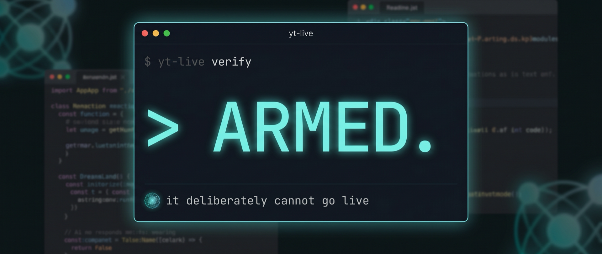

# yt-live



Thin CLI that **arms** a YouTube live broadcast: creates (or idempotently updates) the day's
broadcast with standard metadata, binds it to a named reusable stream key, sets the category,
and uploads the episode thumbnail.

It deliberately **cannot go live**. `liveBroadcasts.transition` is not called anywhere in this
codebase, and there is no command for it:

```
$ yt-live golive
Unknown command: golive. Commands: auth, create, status, verify, thumbnail, stream-ensure
```

Going live is one human action: the operator presses **Start Streaming** in OBS. Because the
broadcast is created with `enableAutoStart`, that press is the go-live act. `enableAutoStop`
ends the broadcast when the encoder stops.

## Commands

| Command | What it does |
|---|---|
| `auth` | One-time OAuth consent (installed-app flow). Tokens stored in `~/.config/yt-live/`, chmod 600, never printed. |
| `stream-ensure` | Create-or-get the named reusable stream. Prints id + title only; **never prints key material**. |
| `create --day N --hook "..." [--privacy public\|unlisted] [--schedule ISO] [--file thumb.jpg]` | Idempotent create-or-update of the day's broadcast: standard title/description, category Science & Technology, autoStart/autoStop, bound to the named stream. |
| `thumbnail --file thumb.jpg` | Set the thumbnail on the upcoming bound broadcast. |
| `verify` | Read-only pre-flight checklist; exit 0 only if armed. |
| `status` | List broadcasts with lifecycle + watch URLs. |

## Install

```
git clone https://github.com/erickcxc/yt-live.git
cd yt-live
npm install
npm link   # puts `yt-live` on your PATH
```

Requires Node 22+.

## Setup (one-time)

1. Google Cloud: create a project, enable **YouTube Data API v3**, create an OAuth client
   (Desktop app). Download the client JSON to `~/.config/yt-live/oauth-client.json`.
2. `yt-live auth` and approve in the browser.
3. `yt-live stream-ensure`, then paste the named stream's key into
   OBS > Settings > Stream, by hand, once. (The CLI never displays it.)

## Design rules

- Pure logic (metadata templates, request bodies, idempotency selection) lives in `lib/metadata.js`
  and `lib/broadcast.js`, fully unit-tested (`npm test`, zero test dependencies, Node 22 `node:test`).
- `lib/api.js` is a logic-free googleapis edge; only ids and titles cross its boundary.
- Running `create` twice never duplicates: an upcoming broadcast bound to the named stream is
  updated in place.
- No em dashes in generated copy (enforced by test).

## Built live

This tool was designed and built in one hour, live on stream (Day 1 of the one-hour build
challenge). The VOD shows every decision, including the ones that went sideways:
https://www.youtube.com/live/aZd25ZrG9A8

Daily builds: https://www.youtube.com/channel/UCWCXKXvNtNbKPkeK_t5CZlg

I build agentic systems like this for businesses. Reach me through the channel.

## License

MIT

